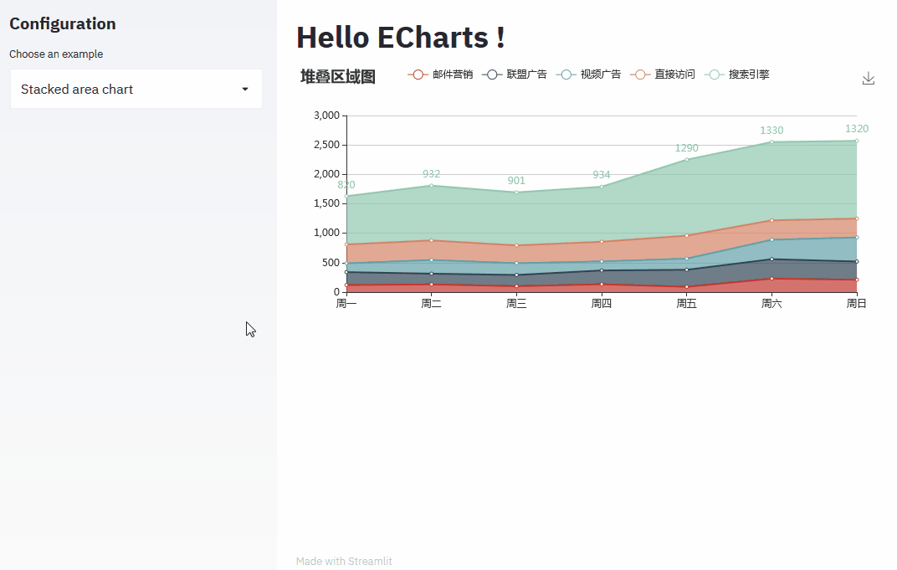

# Streamlit - ECharts

A custom component to run Echarts in Streamlit session.

It's basically a Streamlit wrapper over [echarts-for-react](https://github.com/hustcc/echarts-for-react).



## Install

```shell script
pip install -i https://test.pypi.org/simple/ --no-deps streamlit-echarts
```

## Run

```shell script
streamlit run app.py
```

## Development 

### Install

* JS side

```shell script
cd frontend
npm install
```

* Python side 

```shell script
conda create -n streamlit-echarts python=3.7
conda activate streamlit-echarts
pip install streamlit-0.61.0-py2.py3-none-any.whl
pip install -e .
```

### Run

* JS side

```shell script
cd frontend
npm run start
```

* Python side

```shell script
streamlit run examples/app.py
```

### Usage

Check `examples/` folder for examples.

There's basically 2 ways of generating options :
* Provide a Pyecharts chart, the component will manage the conversion to options (check the [official examples](https://gallery.pyecharts.org/#/))
* Build a Python dict from the desired options (check the [official examples](https://echarts.apache.org/examples/en/index.html))

## Caveats

Pyecharts uses the `--x_x--0_0--` placeholder around `JsCode`, so we parse every value in options
looking for `--x_x--0_0-- function(...) {...} --x_x--0_0--` and parse those as a JS function.

If you want to pass JS function as strings, use the `JsCode` module :

``` 
series: [
    {
        type: 'scatter', // this is scatter chart
        itemStyle: {
            opacity: 0.8
        },
        symbolSize: JsCode("function (val) { return val[2] * 40;}",
        data: [["14.616","7.241","0.896"],["3.958","5.701","0.955"],["2.768","8.971","0.669"],["9.051","9.710","0.171"],["14.046","4.182","0.536"],["12.295","1.429","0.962"],["4.417","8.167","0.113"],["0.492","4.771","0.785"],["7.632","2.605","0.645"],["14.242","5.042","0.368"]]
    }
]
```

To implement [Events and Actions in ECharts](https://echarts.apache.org/en/tutorial.html#Events%20and%20Actions%20in%20ECharts)
you should directly integrate in the React custom component for now so we don't try to parse JS coming from Python.